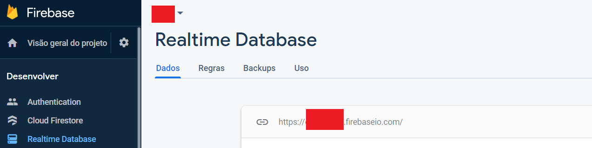

<h1>Simple Chat</h1>

Simple chat with Xamarin Forms using MVVM and Simple Injector. Integration with Fireabase Real Time Database.

  Libraries

  <ul>
    <li>FirebaseDatabase.net</li>
    <li>SimpleInjector</li>
    <li>Xamarin.Forms</li>
  </ul>

  <b>Attention</b>

  For test. Set your url Firebase Real Time Database in a const ADDRESS_FIREBASE at FirebaseEnvironment class.
  
  

  Didn't use rules in real time database because this is a test for send messages.

  <video id="gif-mp4" poster="" style="margin:0;padding:0" width="480" height="426" autoplay="" loop="">
    <source src="https://media3.giphy.com/media/oww3FAsc2z5hULgfTz/giphy.mp4" type="video/mp4; codecs=&quot;avc1.42E01E, mp4a.40.2&quot;">
    
  </video>

